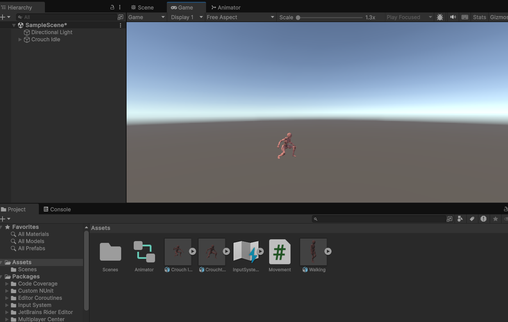
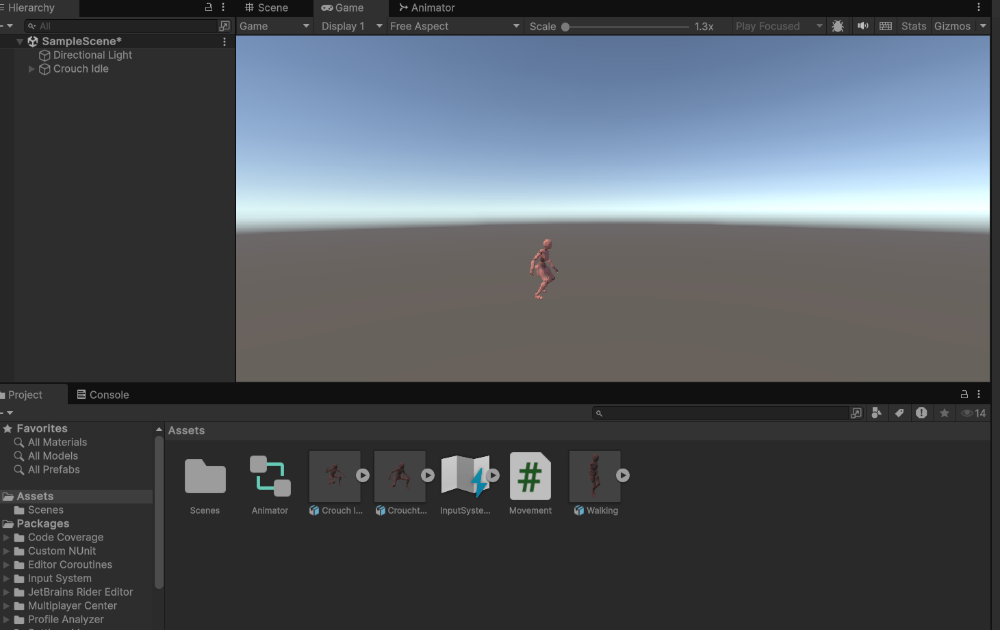
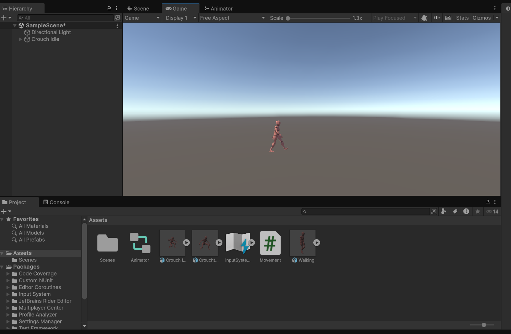

# Ex5-Animator-Movement

## Aim :

To develop a animator movement for a player using unity.

## Algorithm :

## Step 1 : 

Import necessary models.

## Step 2 : 

 Right-click -> Create -> Animator Controller.

## Step 3 : 

Open Animator window, define states (Idle, Run, Jump, etc.).

## Step 4 : 

Use keyframes or Unity's Animation tools to animate transitions between states.

## Step 5 : 

Drag Animator Controller to the GameObject in the Inspector.

## Program :

### DEVELOPED BY : Karthika 
### REG NO : 212222040072

using UnityEngine;

public class Movement : MonoBehaviour
{
   
     public Animator animator;
    public float InputX;
    public float InputY;
    // Start is called before the first frame update
    void Start()
    {
        animator = this.gameObject.GetComponent < Animator>();
    }

    // Update is called once per frame
    void Update()
    {
        InputY = Input.GetAxis("Vertical");
        InputX = Input.GetAxis("Horizontal");
        animator.SetFloat("InputY", InputY);
        animator.SetFloat("InputX", InputX);
    }

}

## Output :

## Result :

An animator movement for a player using unity is developed successfully.